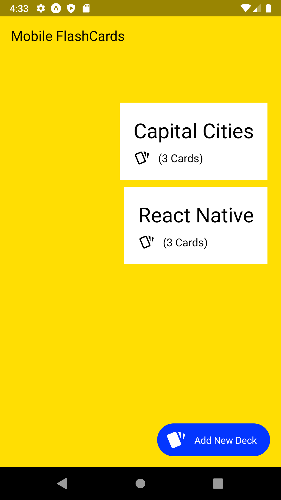
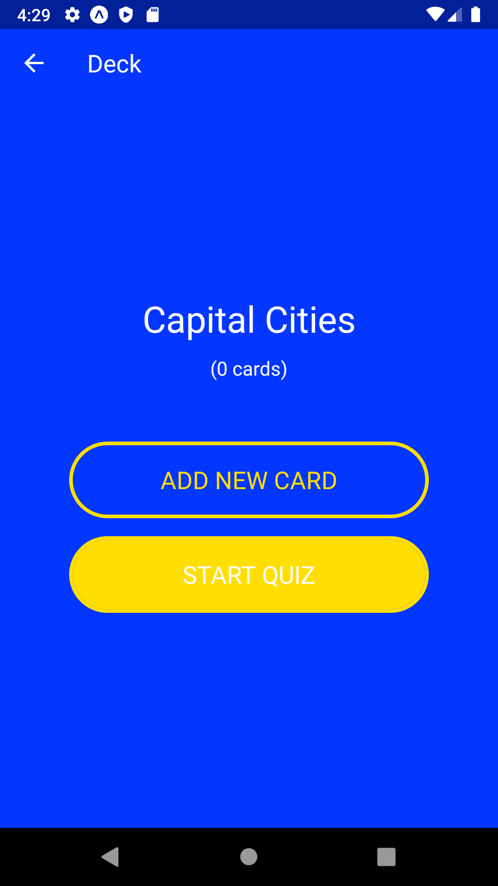
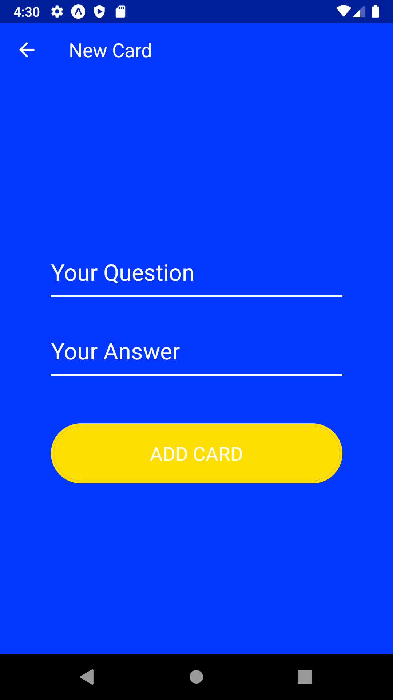
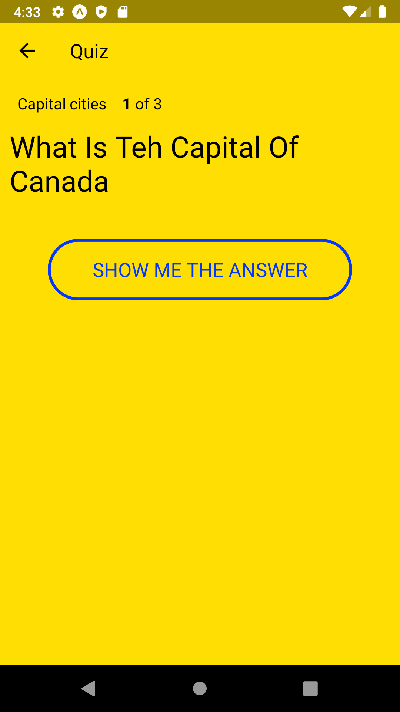
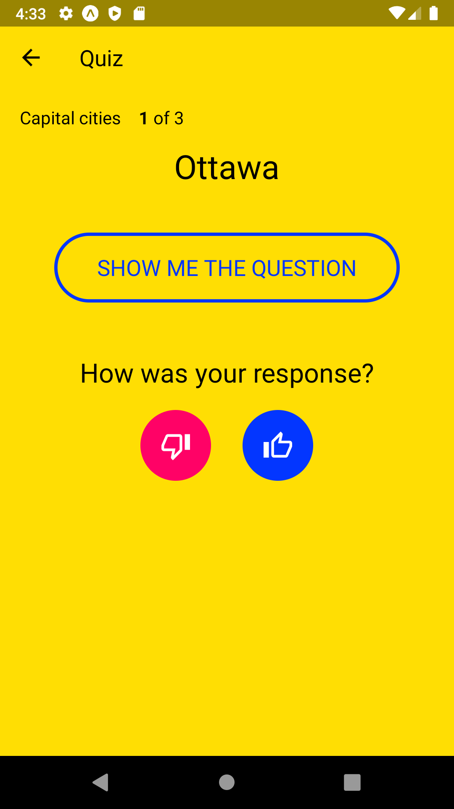
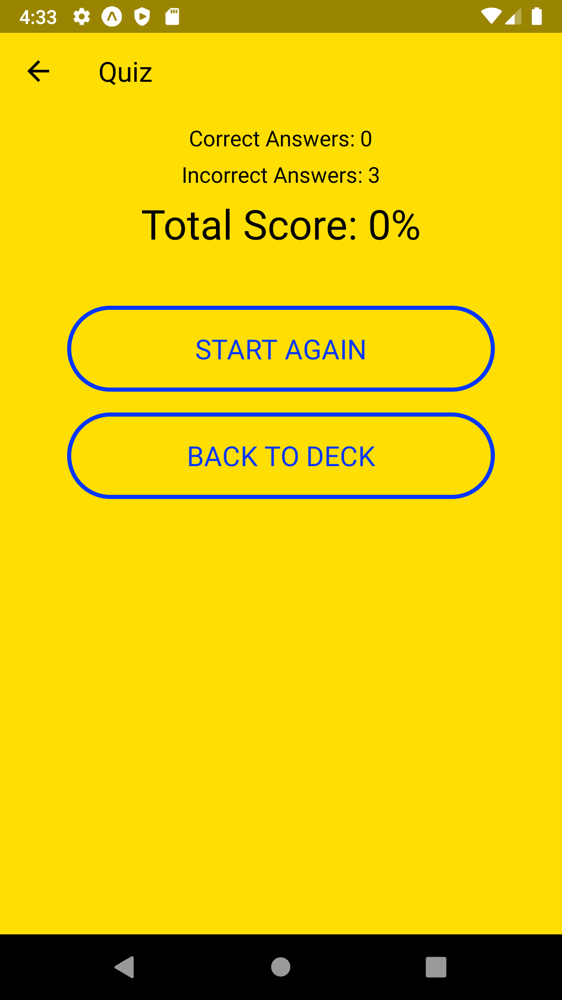

# Mobile FlashCards Project

## Loading the App

The project uses Node.js and the Create-React-Native-App starter. Once Node is installed, navigate to the directory where you want to store the app.

```bash
git clone https://github.com/m-reyes-h/UND-project-Would-You-Rather.git
npm install
npm start
```

## Device Support

The app has been tested on the following devices:
* Google Pixel 3 XL (OS: Android 10)
* Android Emulator (OS: Android Pie)

# Screenshots

### Main screen

You can pick a quiz set from any of the decks and can add new decks.



### Deck screen

You can start a quiz or add more cards



### New Card screen



### Quiz screen



### Quiz Answer screen



### Quiz Score screen

